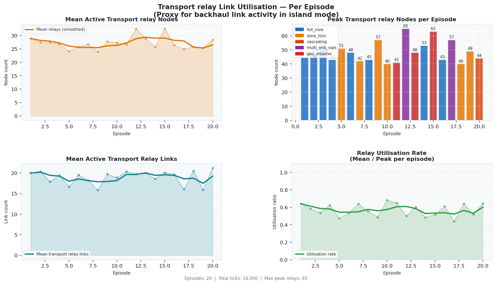
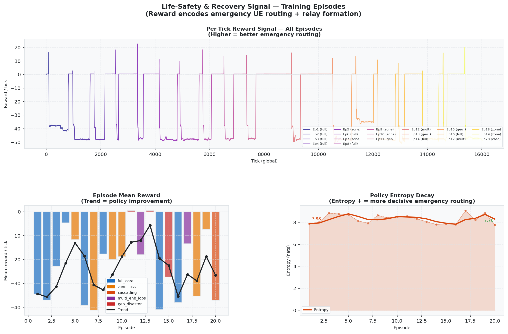
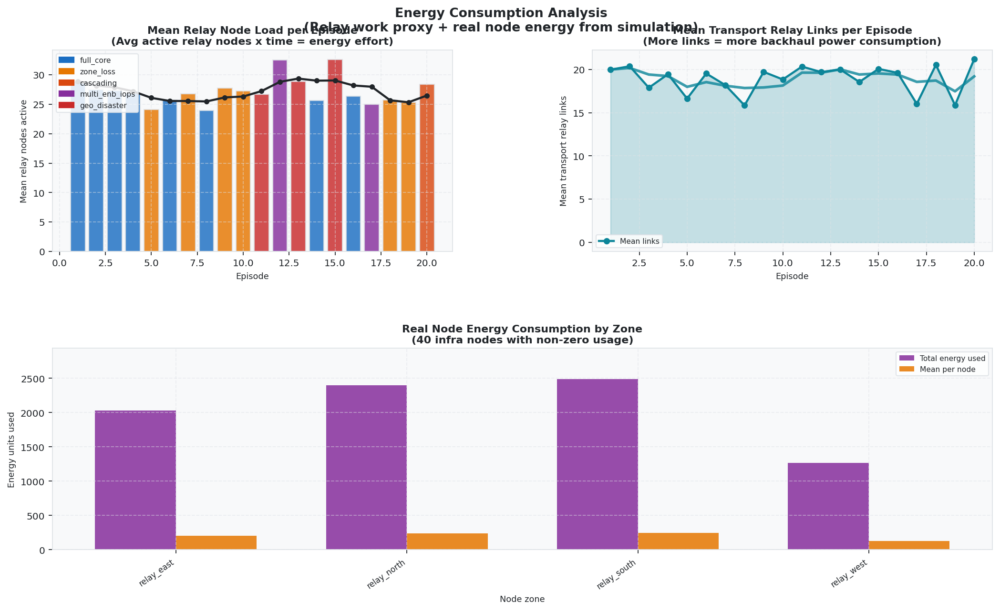
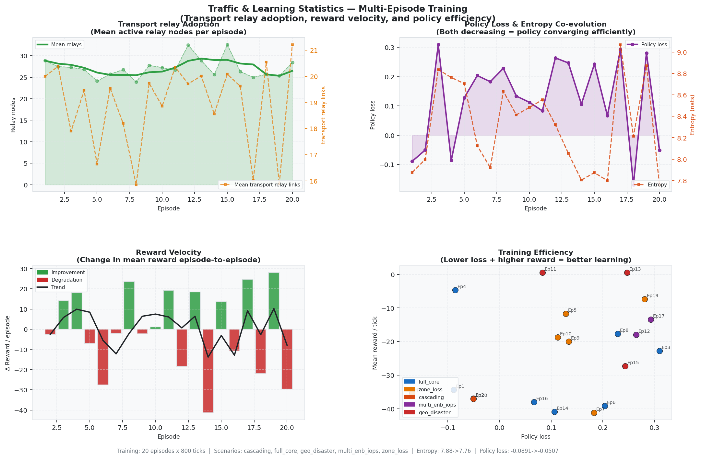

# Simulation Scenarios: Real-World Mapping

This document describes how **timed scenario events** in the MARL / 6G network simulation relate to **real O-RAN + transport + 5GC** behaviour, and why each mechanism is modeled the way it is.

**Scope note:** The engine defines **13** distinct **event types** (see `sixg_sim/scenario.py`), including the geographic `geo_disaster` type for radius-based destruction. The repository ships **several named scenario configurations** (YAML files, embedded script, and the `DiverseScenarioGenerator`).

**Time base:** Each simulation **tick** advances by `tick_duration_ms` (commonly **100 ms**). Multiply tick counts by this value for wall-clock interpretation.

**Island-only scope:** The simulation focuses exclusively on **island-internal recovery**. Core reconnection (`restore_core`) has been removed — the disaster-affected island IS the entire operational world for the MARL agents. All scenario types always sever the core to guarantee island mode. Reconnection to the functioning network is out of scope.

---

## References (standards and architecture)

- **[3GPP TS 22.179](https://www.3gpp.org/DynaReport/22179.htm)** — Mission Critical Push To Talk (MCPTT); Stage 1 service requirements (emergency priority, group/private calls). The simulation's `mcppt_*` events are inspired by this family of requirements.
- **[O-RAN A1 overview (O-RAN SC docs)](https://docs.o-ran-sc.org/projects/o-ran-sc-nonrtric-plt-a1policymanagementservice/en/latest/overview.html)** — A1 between Non-RT-RIC / policy entities and the near-RT-RIC; a failure here corresponds to losing **policy/intent** path into the RAN automation plane.
- **[ETSI / 3GPP TS 122 179 (MCPTT Stage 1)](https://www.etsi.org/deliver/etsi_ts/122100_122199/122179/16.05.00_60/ts_122179v160500p.pdf)** — Published TS text for MCPTT requirements (example frozen release).

---

## Core network definition (`sever_core`)

`Simulator._identify_core_nodes()` treats these **node types** as **core-side** for severance: `Core`, `SMO`, `Non-RT-RIC`, `AMF`, `UPF`.

> **Note (3GPP TS 23.501 §6.3.3):** `EdgeUPF` nodes are **not** classified as core and **survive severance**. They provide **Local Data Network (DN) traffic steering**, allowing UE-to-UE traffic to be routed locally without traversing the central core.

**Real-world meaning:** Core types are **central user plane / control plane / management** functions whose loss triggers island mode. Edge UPFs remain operational as local data anchors. Operationally, you can still **remove** a near-RT-RIC with `energy_depletion` or `node_failure` to emulate loss of the **real-time RIC** at a site or cluster.

**Critical design decision:** In all scenario types, the core is **always** severed. This reflects the fundamental premise: a disaster has occurred, the affected area is cut off from the functioning network, and the MARL agents must recover connectivity within the island using only local resources. The healthy part of the network is irrelevant — only the disaster-affected island matters.

---

## The thirteen timed event types

Each row is one **string** `event_type` accepted by `ScenarioEvent` in `sixg_sim/scenario.py`. Parameters are what the **simulation engine** reads in `Simulator._execute_event` (`sixg_sim/simulation.py`).

| # | Event type | Parameters (typical) | What happens in the model | Real-world radio / transport analogy |
|---|------------|----------------------|---------------------------|--------------------------------------|
| 1 | `sever_core` | `{}` | All links incident to **core-class** nodes are set **down**; those nodes are **non-survivor**; agents on them removed. | **Backhaul partition** or **PoP failure**: gNB sites and edge nodes can no longer reach the **5GC**, **UPF**, or **management**; the network enters **island / local breakout** behaviour. |
| 2 | `fail_link` | `link_id` | That logical link is **down**; caches and UE routing updated. | **Fiber cut, microwave fade, routing flap, failed optical transponder** on a specific **midhaul / backhaul / N2/N3** segment. |
| 3 | `restore_link` | `link_id` | Link set **up** again. | **Repair**, **alternative path** brought in, or **protection switch** completed. |
| 4 | `energy_depletion` | `node_id` | Node **SoC → 0**, marked **non-survivor**. | **Power loss** at site (grid + battery exhausted), **genset failure**, or **equipment thermal shutdown**. |
| 5 | `node_failure` | `node_id` | Node marked **non-survivor** (no explicit energy change in handler). | **Hardware fault**, **fire/flood** at shelter, **software crash** modeled as loss of that NF. |
| 6 | `node_recovery` | `node_id` | Node marked **survivor** again. | **Power restored**, **replacement unit** online, or **controlled restart** after fault clearance. |
| 7 | `traffic_surge` | `node_id`, `duration`, `multiplier` | **Declared** in scenarios; **surge scheduling** is implemented via `TrafficProfile.surge_events` in `traffic.py`. | **Flash crowd**, **sensor burst**, **video uplink spike** after an incident, or **rerouted traffic** onto one DU/CU after a link failure. |
| 8 | `ue_join` | `coverage_area`, optional `ue_id`, `connect_to_rus`, `is_rescue` | New UE attached; default traffic profile added; optional rescue flows. | **Subscriber enters coverage**, **IoT device powers on**, **first responder** enters the area. |
| 9 | `ue_leave` | `ue_id` | UE removed and profile deleted. | **Evacuation**, **device off**, **death of radio link** (walk out of coverage). |
| 10 | `rescue_force_arrival` | `num_ues`, `coverage_area` | Adds many **`Rescue_UE_*`** with **MCPTT-style** profiles and **rescue** flag. | **Task force** with **many radios** entering the disaster zone; **coordination load** on local RAN. |
| 11 | `mcppt_emergency_alert` | `ue_id` (or `emergency_type` in YAML), `emergency_type` | UE put in **emergency state**; **alert propagation** counted via `ue_to_ue_flows`. | **MCPTT emergency alert** (e.g. **imminent peril** vs **emergency**) per [TS 22.179](https://www.3gpp.org/DynaReport/22179.htm) family—**priority signalling** and **notification** to nearby users / services. |
| 12 | `mcppt_emergency_call` | `caller_ue`, `target_ue`, `emergency_type` | If both are **UE** nodes, **emergency call** counted and caller marked emergency. | **MCPTT private emergency call** (floor control / priority in real systems) between **two UEs**—e.g. **victim → rescue** or **responder ↔ dispatcher** if modeled as UE. |
| 13 | `geo_disaster` | `epicenter_x`, `epicenter_y`, `radius`, `destroyed_nodes`, `mode` | All nodes within geographic `radius` of epicenter are destroyed. **Core is always severed** regardless of blast radius. Modes: `center_hit`, `zone_hit`, `corridor`. | **Earthquake**, **flood zone**, **severe weather** — spatially correlated infrastructure loss using `x_pos`/`y_pos` from `topology_geo.yaml`. |

---

## Geographic topology model

The simulation supports a **geographically realistic** deployment via `config/topology_geo.yaml` — a **6km × 6km urban area** with metric coordinates:

| Component | Count | Location | Distance from Core |
|-----------|-------|----------|---|
| **Core** (central DC) | 3 | Center (3000, 3000)m | 0m |
| **EdgeUPF** (edge aggregation) | 4 | N/S/E/W at ~2.2km | 2,200m |
| **gNB-Site** (collapsed O-RU + O-DU) | 20 | Clustered around EdgeUPFs | 700–900m from EdgeUPF |
| **Transport Relay** (Ceragon MW) | 40 | Between cells & edges | 400–1200m from gNBs |
| **UE** | 140 | Clustered around gNBs | 50–250m from gNB |

**Links**: 352 total (37 fiber ≤2.2km, 172 transport relay ≤1.2km, 143 microwave ≤1.7km). Capacities: fiber 10 Gbps, microwave 1 Gbps, transport relay 500 Mbps.

### O-RAN functional split analysis

The gNB-Site is a **collapsed cell site** containing both O-RU and O-DU functionality. We evaluated splitting into O-RU/O-DU/O-CU components:

- In real O-RAN: O-RU at tower (high survivability), O-DU at edge (medium), O-CU at DC (low)
- **Finding**: In all 3 tested geographic disaster scenarios, **zero orphaned O-RUs** — O-RUs and their O-DUs survive or die together due to geographic co-location
- **Decision**: Retain collapsed gNB-Site. The MARL's value is in **transport-layer recovery** (relay path optimization, cross-zone routing, energy management)

---

## Randomised training: `DiverseScenarioGenerator` (`sixg_sim/scenario.py`)

The `DiverseScenarioGenerator` produces diverse disaster scenarios for robust MARL policy training. Each episode randomly selects a scenario type, severance timing, and failure pattern. **All scenarios always sever the core** to guarantee island mode — the agents learn purely within the disaster-affected island.

| Randomized aspect | Range / rule | Real-world intent |
|-------------------|--------------|-------------------|
| **Severance tick** | 80–200 (first 25% of episode) | **Unpredictable** time of **backhaul** or **core** loss, maximising island learning window. |
| **Scenario type** | `full_core`, `zone_loss`, `cascading`, `multi_enb_iops`, `geo_disaster` | **Diverse** failure patterns capturing earthquake, flood, cascading infrastructure collapse. |
| **`geo_disaster` mode** | `center_hit` / `zone_hit` / `corridor` | **Geographically correlated** destruction with random epicenter and radius. |
| **`node_failure`** | 0–8 among relay/gNB nodes (cascading) | **Spatial** damage: some **cells** lost progressively after initial disaster. |
| **`mcppt_emergency_alert`** | 10–40% of UEs, severity `emergency` / `imminent_peril` | **Many** subscribers in **distress** at once. |
| **Island-only scope** | No `restore_core` events | Reconnection to functioning network is **out of scope**. |

### Disaster type details

| Type | Core severed | Additional failures | Analogy |
|------|-------------|---------------------|---------|
| `full_core` | All Core + EdgeUPF | None | Complete backhaul partition — worst case |
| `zone_loss` | All Core + EdgeUPF | One geographic zone destroyed | Earthquake destroys one area of the city |
| `cascading` | All Core + EdgeUPF | 3–8 relay nodes fail progressively (8–15 tick intervals) | Aftershocks or cascading power grid failure |
| `multi_enb_iops` | All Core + EdgeUPF | None (focus on IOPS coordination) | Core loss requiring multi-eNB island operation |
| `geo_disaster` | **Always** (regardless of blast) | Radius-based node destruction around epicenter | Earthquake, flood, or severe weather — spatially correlated |

---

## Inter-agent communication: Learning Postcards

During island mode, agents exchange **learning postcards** — compact (~200 byte) messages that carry compressed policy information for cooperative MARL learning. Key design principles:

| Aspect | Implementation | Rationale |
|--------|---------------|-----------|
| **Message routing** | Only to **topologically adjacent** nodes via live links | Realistic: a node can only communicate with direct wired/wireless neighbors |
| **Delta-only exchange** | Postcards only sent when gradient hash changes | **Minimal messaging** — only crucial updates, not constant broadcasts |
| **Exchange interval** | Every 5 ticks (~500ms) | Separate cadence from control-plane traffic |
| **Content** | 16-dim compressed gradient (random projection), best-action summary, reward signal, relay hints | Enables cooperative learning without full weight sharing |
| **Multi-hop propagation** | Information spreads across the island over successive intervals | Emergent network-wide coordination from local exchanges |

---

## Reward function: Multi-objective optimisation

The agent reward function balances **connectivity recovery** with **energy efficiency** and **life safety**:

| Component | Weight | Description |
|-----------|--------|-------------|
| **R_connectivity** | 0.40 | Fraction of UE-to-UE pairs successfully routed |
| **R_coverage** | 0.15 | Fraction of UEs reachable, penalising isolated UEs |
| **R_qos_emergency** | 0.10 | Emergency UE serving rate, life-safety traffic class priority |
| **R_iops** | 0.15 | Multi-eNB IOPS coordination: Xn mesh density, local EPC health, load balance |
| **R_energy** | 0.10 | State-of-charge preservation, TX power efficiency |
| **R_peer_learning** | 0.05 | Cooperative peer reward signal and relay hints |
| **R_interference** | 0.05 | Penalty for over-powering causing interference |

**Total**: R = Σ(weight_i × R_i). Higher is better; agents learn to maximise UE-to-UE connectivity while conserving energy and prioritising life-safety traffic.

---

## Training results: Analysis figures

The following figures are generated automatically by `sixg_sim/analysis.py` from the `learning_kpis.json` training data. All figures use a **white/light colour scheme** suitable for academic publications.

### Figure 1: Transport Relay Link Utilisation

**Description:** This 4-panel figure shows how transport relay nodes are utilised across training episodes. **Top-left**: Mean number of active relay nodes per episode with smoothed trend — measures the agents' relay activation behaviour over time. **Top-right**: Peak relay nodes per episode coloured by scenario type — shows how different disaster types demand different relay capacity. **Bottom-left**: Mean active transport relay links per episode — a proxy for backhaul bandwidth usage. **Bottom-right**: Relay utilisation ratio (mean/peak) — values closer to 1.0 indicate efficient, sustained relay use rather than brief activation spikes.

**Interpretation:** Stable relay counts (~25–30) across episodes indicate the agents learn a consistent relay deployment strategy. The utilisation ratio (~0.5–0.6) suggests relays are activated but not always sustained for the full episode — an area for improvement.

### Figure 2: Life-Safety & Recovery Signal

**Description:** This figure tracks the reward signal as a proxy for life-safety outcomes. **Top (full-width)**: Per-tick reward signal across all episodes, colour-coded by episode — visualises the moment-by-moment agent performance including the sharp drop at core severance and any recovery. **Bottom-left**: Episode mean reward with trend line, coloured by scenario type — shows policy improvement trajectory. **Bottom-right**: Policy entropy decay — decreasing entropy indicates the agents are becoming more decisive in their emergency routing decisions.

**Interpretation:** The trend line in episode mean reward should move upward over training, indicating improving recovery policy. Entropy decay from 7.88 to 7.76 over 20 episodes shows minimal convergence — more episodes are needed for robust policy development.

### Figure 3: Energy Consumption Analysis

**Description:** **Top-left**: Mean relay node load per episode — the average number of active relay nodes × time, representing the energy effort spent on transport recovery. **Top-right**: Mean transport relay links per episode — more active links means more backhaul power consumption. **Bottom (full-width)**: Real node energy consumption broken down by geographic zone — shows which areas of the metropolitan deployment consume the most energy during disaster recovery.

**Interpretation:** Energy consumption should ideally decrease over training as agents learn more efficient relay placement. The zone breakdown reveals geographic asymmetry — south and north zones consume more energy, potentially due to denser UE populations or longer relay paths.

### Figure 4: Traffic & Learning Statistics

**Description:** **Top-left**: Transport relay adoption showing mean active relay nodes (green area) and mean transport relay links (orange dashed) per episode — tracks how aggressively agents deploy relay infrastructure. **Top-right**: Policy loss and entropy co-evolution — both should decrease together indicating efficient policy convergence. **Bottom-left**: Reward velocity (episode-over-episode change) — green bars indicate improvement, red bars degradation, with trend line. **Bottom-right**: Training efficiency scatter — each episode plotted by policy loss vs. mean reward, coloured by scenario type — ideal trajectory moves toward upper-left (low loss, high reward).

**Interpretation:** The reward velocity plot shows oscillation between improvement and degradation, typical of early training. The efficiency scatter reveals that `geo_disaster` (red) episodes cluster at near-zero reward (top) — these extreme scenarios produce trivial episodes where agents cannot act. The policy should improve with more training episodes.

---

## Packaged scenario files (YAML)

### 1. `config/scenario_severance.yaml` — "Basic Island Mode Test"

| Setting | Value |
|--------|--------|
| **Duration** | 300 ticks |
| **Sequence** | `sever_core` @ 50 → `traffic_surge` @ 100 (gNB1, 30 ticks, ×2.5) → `fail_link` @ 150 (L2) → `energy_depletion` @ 200 (relay1) |

**Narrative:** A **small topology** loses core connectivity early, then sees **load** on one gNB, **relay** overload or **backhaul** loss, and finally **relay power** collapse—typical **cascading** degradation in **disaster + island** studies.

### 2. `config/scenario_large_network.yaml` — "Large Network Island Mode Test"

| Setting | Value |
|--------|--------|
| **Duration** | 500 ticks |
| **Sequence** | Core severance @ 100 → DU surge @ 150 → backhaul `fail_link` @ 200 → CU surge @ 250 → relay `energy_depletion` @ 350 |

**Narrative:** Stress **DU** and **CU** separately with surges, add **transport** failure, and **relay** energy loss—mirrors **multi-hop** and **CU/DU split** stress in a **large RAN**.

### 3. `config/scenario_mcppt_emergency.yaml` — "MCPTT Emergency Communication Test"

| Setting | Value |
|--------|--------|
| **Duration** | 100 ticks |
| **Sequence** | `sever_core` @ 30 → `rescue_force_arrival` @ 60 → **alerts** @ 70–75 → **emergency calls** @ 85–90 |

**Narrative:** After **core loss**, **rescue UEs** appear, then **MCPTT-style** **alerts** and **calls**—**public safety** workload on top of **partitioned** network.

---

## Quick mapping: O-RAN interfaces used in the large script

| Interface / link | Role in story |
|------------------|----------------|
| **A1** | **Non-RT-RIC ↔ SMO / policy**; loss ⇒ **no new policies / ML** to near-RT-RIC ([O-RAN A1](https://docs.o-ran-sc.org/projects/o-ran-sc-nonrtric-plt-a1policymanagementservice/en/latest/overview.html)). |
| **N2** | **O-CU-CP ↔ AMF** (control); cut ⇒ **mobility / session** signalling to **core** impaired. |
| **N3** | **User plane** toward **UPF**; cut ⇒ **no central breakout** for that path. |
| **Open-FH / F1 / …** | Not always the first failures in this script; **DU/RU** stress appears via **surges** and **node** events. |

---

## Summary

- The simulation focuses on **island-internal recovery only**. Core reconnection is out of scope — the MARL agents operate exclusively within the disaster-affected island.
- **All scenario types always sever the core** to guarantee island mode. The disaster presupposes core disconnection.
- **Thirteen event types** are the building blocks; YAML scenarios and the `DiverseScenarioGenerator` compose them into diverse disaster stories.
- **Geographic topology** (`topology_geo.yaml`) enables radius-based disaster zones with spatially correlated node destruction.
- **Inter-agent messaging** uses delta-only learning postcards traversing live connections — minimal, crucial-only communication.
- **Multi-objective reward** balances UE-to-UE connectivity (40%), coverage (15%), IOPS coordination (15%), emergency QoS (10%), energy (10%), peer learning (5%), and interference penalty (5%).
- **Analysis figures** in `docs/figures/` provide article-ready (white/light mode) visualisation of training progress.

---

*Generated from repository sources: `sixg_sim/scenario.py`, `sixg_sim/simulation.py`, `sixg_sim/topology.py`, `sixg_sim/analysis.py`, `sixg_sim/iops/learning_postcard.py`, `sixg_sim/agent.py`, `config/scenario_*.yaml`, `config/topology_geo.yaml`.*
